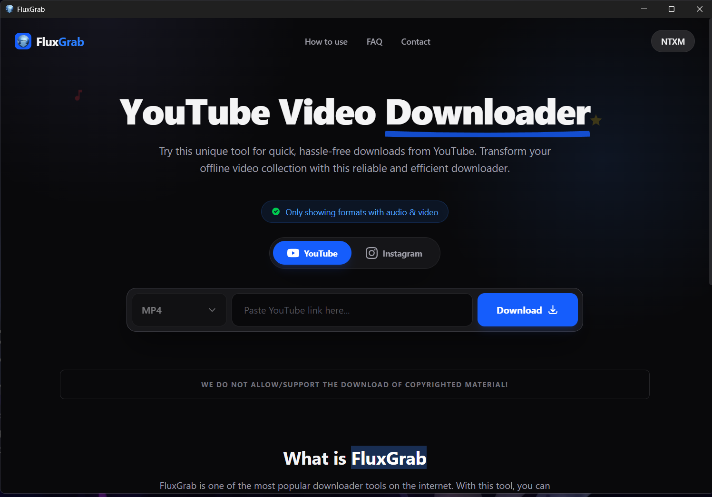
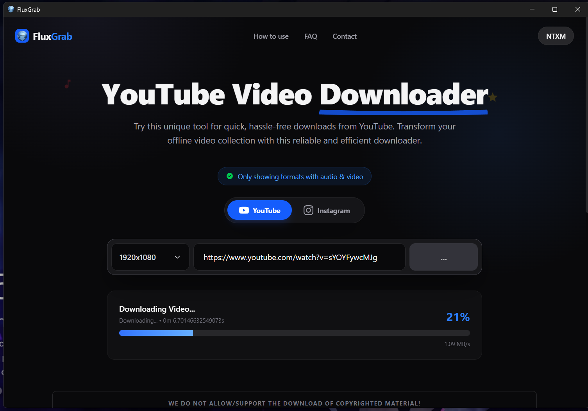
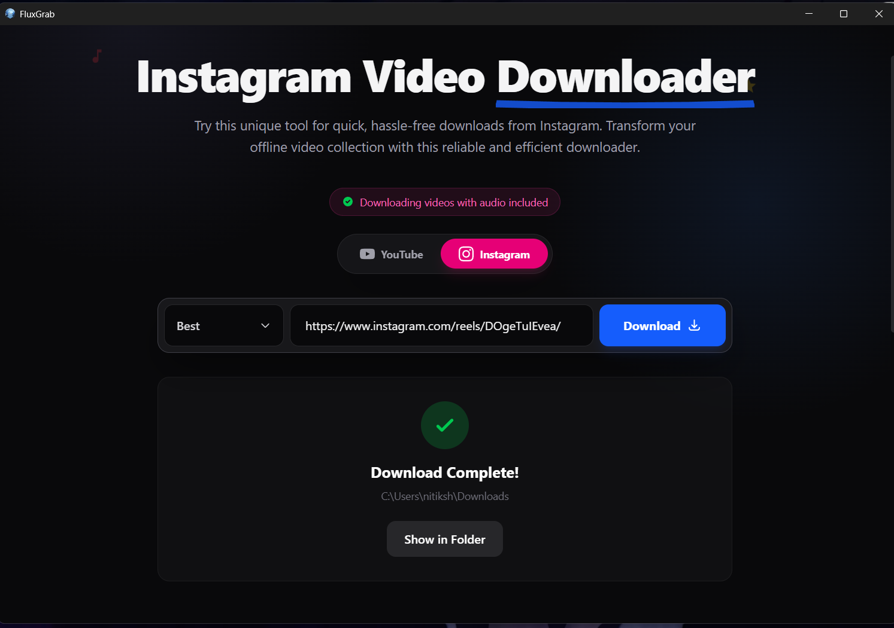

  
  
  # FluxGrab
  
  **The Ultimate Desktop Video Downloader for YouTube & Instagram**
  
  
  
  

  

    <a href="#features">Features</a> •
    <a href="#screenshots">Screenshots</a> •
    <a href="#how-to-use">How To Use</a> •
    <a href="#download">Download</a>
  

---

## 🚀 About FluxGrab

**FluxGrab** is a lightweight, professional-grade desktop application designed to make downloading video content effortless. Whether you are archiving 4K YouTube content or saving Instagram Reels for offline viewing, FluxGrab handles it all with a sleek, dark-mode interface.

Built by **[NTXM](https://ntxm.org)**, it focuses on speed, simplicity, and high-quality output without the bloat of browser extensions or ad-filled websites.

## ✨ Key Features

* **Multi-Platform Support:** Seamlessly download from **YouTube** and **Instagram**.
* **High-Quality Downloads:** Support for 1080p, 4K, and other available resolutions.
* **Smart Auto-Detection:** Paste a link, and FluxGrab automatically detects the platform and available formats.
* **Audio & Video:** Options to download full video with audio or extract audio tracks.
* **Real-Time Progress:** Visual progress bar with speed indicators and completion status.
* **One-Click Access:** Open your downloaded file location instantly upon completion.
* **Privacy Focused:** No external servers store your data; everything happens locally on your machine.

---

## 📸 Screenshots

| **Home Screen** | **Downloading Process** |
|:---:|:---:|
|  |  |

| **Instagram Support** |
|:---:|
| 

---

## 🛠️ How to Use

FluxGrab is designed for a "3-Step" workflow:

1.  **Copy URL** 📋
    * Find the video you want to download on YouTube or Instagram and copy the link from your browser.
2.  **Paste & Select** 🖱️
    * Paste the link into FluxGrab.
    * Select your desired resolution (e.g., 1920x1080) or format.
3.  **Download** 📥
    * Click the **Download** button. The file will be saved to your device instantly.

---

## 📥 Installation

1.  Go to the [Releases](https://github.com/ntxmproducts/FluxGrab/releases/) page.
2.  Download the latest `.exe` installer for Windows.
3.  Run the installer and launch FluxGrab.

---

## ⚠️ Disclaimer

> **WE DO NOT ALLOW/SUPPORT THE DOWNLOAD OF COPYRIGHTED MATERIAL!**

FluxGrab is strictly intended for personal use (e.g., downloading your own content, public domain content, or content with a Creative Commons license). Please respect the copyright laws of your country and the Terms of Service of the respective platforms (YouTube/Instagram).

---

## 🔗 Connect with NTXM

* **Website:** [https://ntxm.org](https://ntxm.org)
* **Developer:** [Nitiksh](https://nitiksh.ntxm.org)
* **Twitter/X:** [@NTXM](https://twitter.com/NTXM)

---

  Built with ❤️ by Nitiksh @ NTXM

